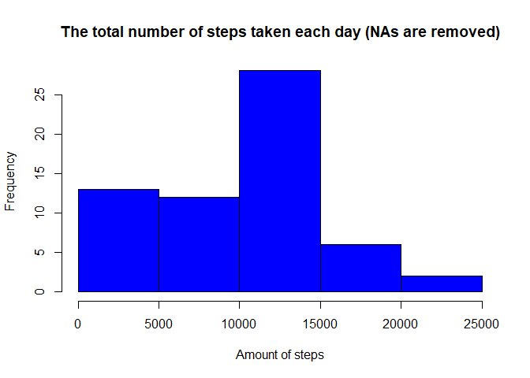
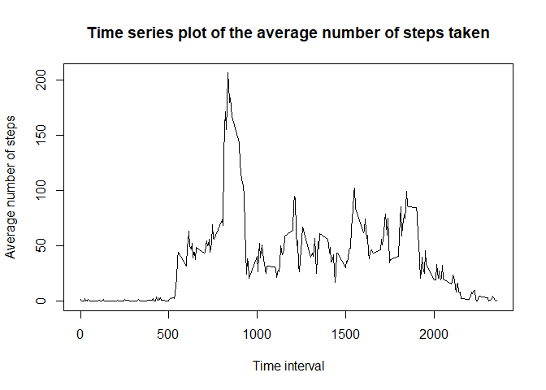
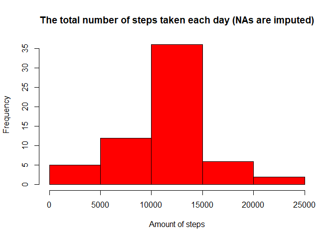
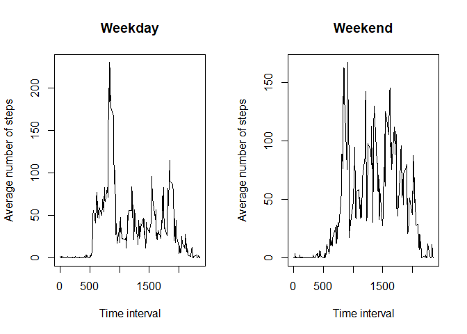

## Loading and preprocessing the data

Let's load all libraries at first.

```r
library(zip)
```

```
## 
## Attaching package: 'zip'
```

```
## The following objects are masked from 'package:utils':
## 
##     unzip, zip
```

```r
library(lubridate)
```

```
## 
## Attaching package: 'lubridate'
```

```
## The following objects are masked from 'package:base':
## 
##     date, intersect, setdiff, union
```

Now, unpacking our data.

```r
unzip("./activity.zip")
data <- read.csv("activity.csv")
```

## What is mean total number of steps taken per day?

Let's plot a histogram of the total number of steps taken each day and look at mean and median number of steps taken each day.

```r
steps_per_day <- tapply(data$steps, data$date, sum, na.rm = TRUE)
hist(steps_per_day,
     xlab = "Amount of steps",
     ylab = "Frequency",
     main = "The total number of steps taken each day (NAs are removed)",
     col = "blue")
```

<!-- -->

```r
mean(steps_per_day)
```

```
## [1] 9354.23
```

```r
median(steps_per_day)
```

```
## [1] 10395
```

## What is the average daily activity pattern?

Now, we are plotting a time series plot of the 5-minute interval and the average number of steps taken, averaged across all days.  
We are also finding the maximum number of steps in a 5-minute interval.

```r
average_steps <- tapply(data$steps, data$interval, mean, na.rm = TRUE)
plot(names(average_steps),
     average_steps,
     type = "l",
     xlab = "Time interval",
     ylab = "Average number of steps",
     main = "Time series plot of the average number of steps taken")
```

<!-- -->

```r
max(average_steps)
```

```
## [1] 206.1698
```

## Imputing missing values

Let's calculate the number of missing values in our dataset.

```r
nrow(data[which(is.na(data$steps)), ])
```

```
## [1] 2304
```

Next, imputing NAs with the mean for each 5-minute interval in a new dataset.  
Also checking the number of missing values.

```r
imp_data <- data
for(i in 1:nrow(imp_data)){
    if(is.na(imp_data$steps[i])){
        imp_data$steps[i] <- average_steps[as.character(imp_data$interval[i])]
    }
}
nrow(imp_data[which(is.na(imp_data$steps)), ])
```

```
## [1] 0
```

Histogram of the total number of steps taken each day (imputed NAs) + mean and median number of steps taken each day.

```r
steps_per_day_imp <- tapply(imp_data$steps, imp_data$date, sum, na.rm = TRUE)
hist(steps_per_day_imp,
     xlab = "Amount of steps",
     ylab = "Frequency",
     main = "The total number of steps taken each day (NAs are imputed)",
     col = "red")
```

<!-- -->

```r
mean(steps_per_day_imp)
```

```
## [1] 10766.19
```

```r
median(steps_per_day_imp)
```

```
## [1] 10766.19
```
So, as we can see, imputing slightly changed the mean and median values and the shape of the distribution compared to the case where missing values are just dropped (it became more "normal").

## Are there differences in activity patterns between weekdays and weekends?

Here we're creating the variable called "day" in which we define if this day is a weekday or a weekend and then we are plotting a plot graph that corresponds to weekdays and weekends.

```r
imp_data$day <- wday(imp_data$date)
par(mfrow = c(1,2), mar = c(5,4,4,4))
average_steps_weekday <- tapply(imp_data$steps[which(imp_data$day %in% c(2,3,4,5,6))],
                                imp_data$interval[which(imp_data$day %in% c(2,3,4,5,6))],
                                mean,
                                na.rm = TRUE)
plot(names(average_steps_weekday),
     average_steps_weekday,
     type = "l",
     xlab = "Time interval",
     ylab = "Average number of steps",
     main = "Weekday")

average_steps_weekend <- tapply(imp_data$steps[which(imp_data$day %in% c(1,7))],
                                imp_data$interval[which(imp_data$day %in% c(1,7))],
                                mean,
                                na.rm = TRUE)
plot(names(average_steps_weekend),
     average_steps_weekend,
     type = "l",
     xlab = "Time interval",
     ylab = "Average number of steps",
     main = "Weekend")
```

<!-- -->
